## danmu_api 在 vercel 的部署指南（含 Fork 自动同步， 让自己的弹幕api实时的同步作者的代码）

本仓库为仅针对 Vercel 的部署教程，指导你从 Fork 原仓库到 Vercel 部署，并配置 GitHub Actions 定时同步上游更新，让 Vercel 自动重新部署。

参考项目：[`huangxd-/danmu_api`](https://github.com/huangxd-/danmu_api)

---

### 目录
- 前置准备
- 部署到 Vercel（通过 Fork 的仓库）
- 配置 Fork 自动同步（GitHub Actions）
- 可选：禁用上游用于 Docker 的 Workflow
- 常见问题（FAQ）

---

### 前置准备
- 一个 GitHub 账号
- 一个 Vercel 账号（将使用 GitHub 登录）

---

### 一、Fork 原作者项目
1. 打开上游仓库：[`huangxd-/danmu_api`](https://github.com/huangxd-/danmu_api)

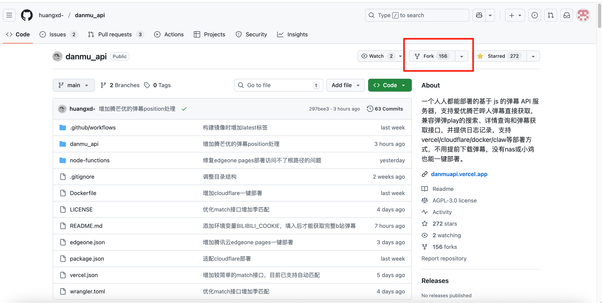

2. 点击右上角的 Fork，将仓库 Fork 到你自己的账号下。

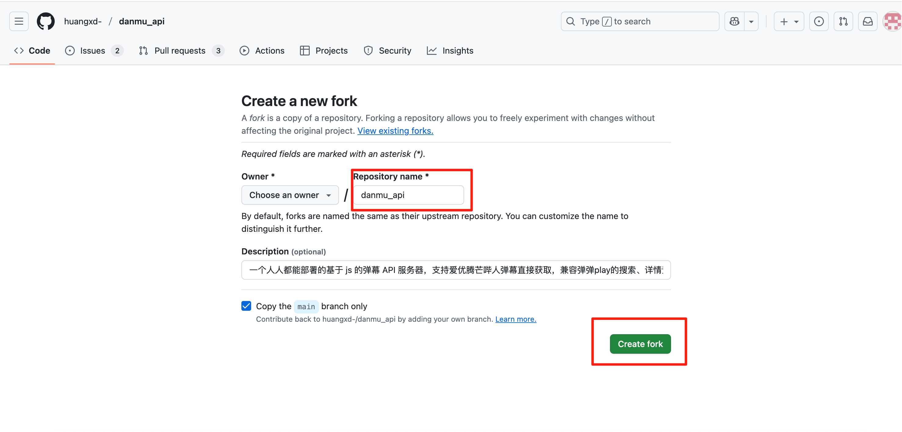

> 参考：仓库主页包含 Vercel/Cloudflare/Docker 等多种部署方式；本指南仅覆盖 Vercel 流程。

---

### 二、登录 Vercel 并导入项目
1. 打开 Vercel 登录页：[`https://vercel.com/login`](https://vercel.com/login)，使用 GitHub 账号登录。

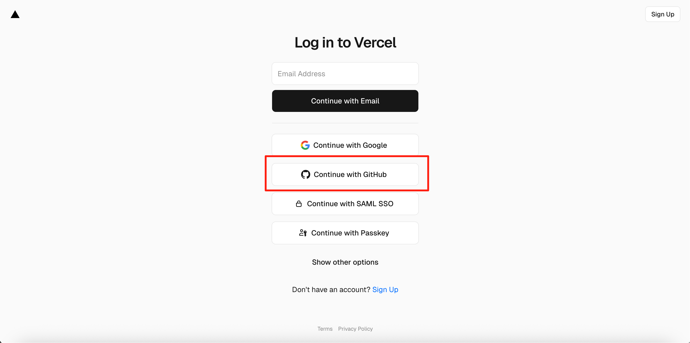

2. 在 Vercel 仪表盘选择 Add New Project（新增项目）。

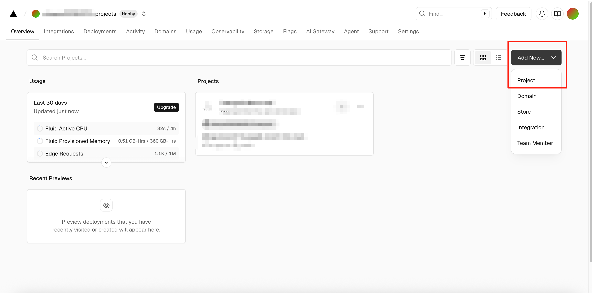

3. 导入你刚 Fork 的仓库（通常名为 `danmu_api`）。

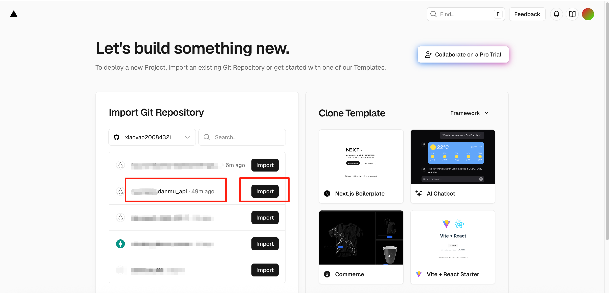

4. 点击Deploy按钮即可完成部署。部署完成后将得到形如 `https://{your_project}.vercel.app` 的访问地址。

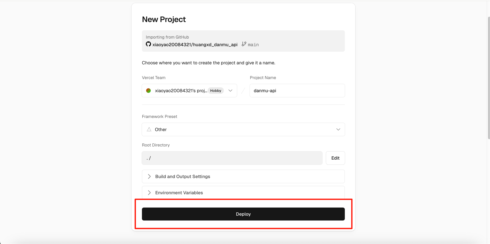

---

### 三、配置 Fork 自动与上游同步（GitHub Actions）
目的：每天自动拉取上游 `huangxd-/danmu_api` 的 `main` 分支更新到你 Fork 的 `main`，从而触发 Vercel 自动重新部署。

1. 打开你 Fork 后的 GitHub 仓库，进入 `Actions`。

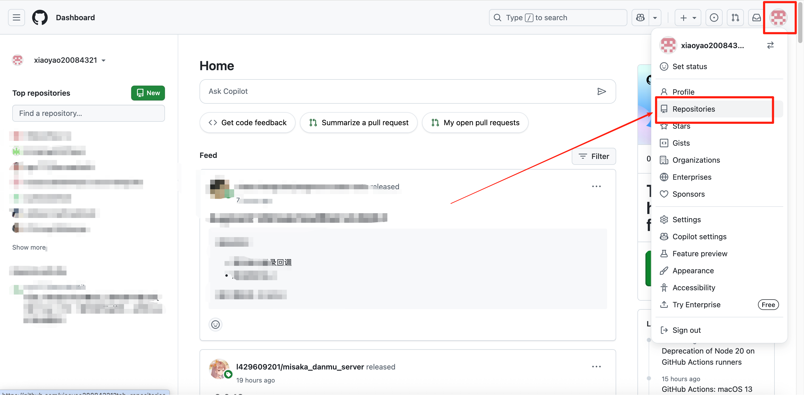
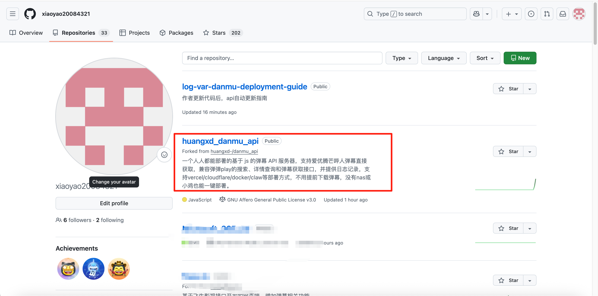
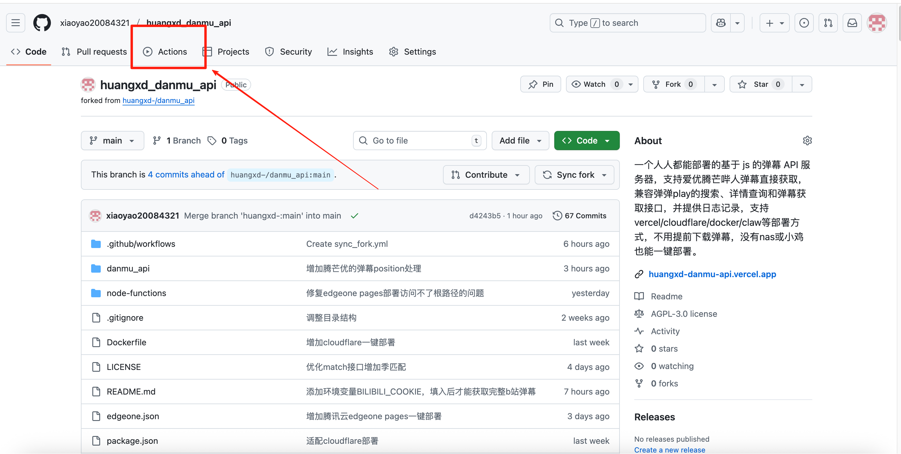

2. 点击 "I understand my workflows, go ahead and enable them"。

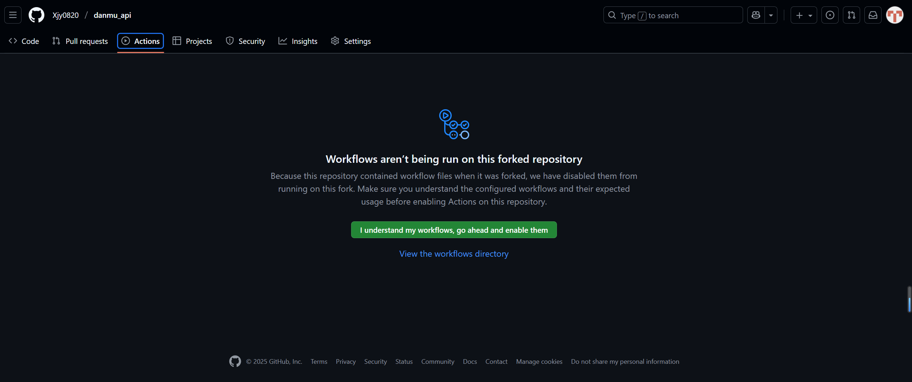

3. 点击 "New workflow"。

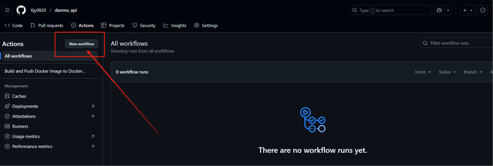

4. 点击 "set up a workflow yourself"。


5. 将文件名改为 `sync_fork.yml`。
6. 在编辑器中粘贴以下内容后保存提交（Commit changes...）：

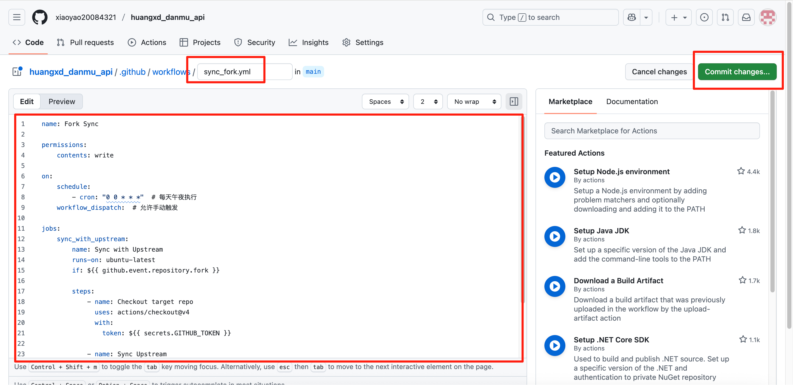

```yaml
name: Fork Sync

permissions:
    contents: write

on:
    schedule:
        - cron: "0 0 * * *"  # 每天午夜执行
    workflow_dispatch:  # 允许手动触发

jobs:
    sync_with_upstream:
        name: Sync with Upstream
        runs-on: ubuntu-latest
        if: ${{ github.event.repository.fork }}

        steps:
            - name: Checkout target repo
              uses: actions/checkout@v4
              with:
                token: ${{ secrets.GITHUB_TOKEN }}

            - name: Sync Upstream
              uses: aormsby/Fork-Sync-With-Upstream-action@v3.4
              with:
                  target_repo_token: ${{ secrets.GITHUB_TOKEN }}
                  upstream_sync_repo: huangxd-/danmu_api
                  upstream_sync_branch: main
                  target_sync_branch: main
                  test_mode: false

            - name: Check for new commits
              if: success()
              run: echo "Sync completed successfully"

            - name: Check for Failure
              if: failure()
              run: |
                  echo "[Error] Sync failed. This might be due to:"
                  echo "1. Changes in the upstream workflow file"
                  echo "2. Merge conflicts that need manual resolution"
                  echo "3. Network issues"
                  echo "Please check the logs and consider manual sync if needed."
                  exit 1
```

7. 回到 `Actions`，选择你刚创建的 `Fork Sync` 工作流，点击 "Run workflow" 验证是否成功。

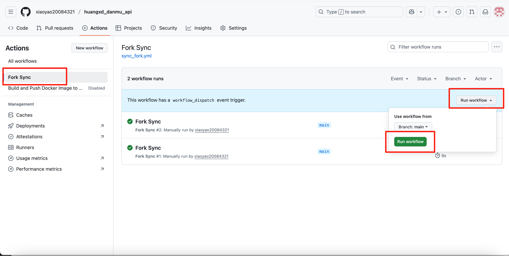

8. 若成功，每日将自动同步上游更新；同步后 Vercel 会基于你 Fork 的仓库自动重新部署。

---

### 四、可选：禁用原作者用于 Docker 的 Workflow（不做这一步，可能邮箱中会收到报错提示，但不影响弹幕api）
上游有用于自动构建 Docker Hub 镜像的工作流；若你不需要，可在你的 Fork 中禁用：
1. 打开 `Actions`。
2. 选择名为 “Build and Push Docker Image to Docker Hub” 的工作流。
3. 点击页面右上角 “···” 菜单，选择 “Disable workflow”。

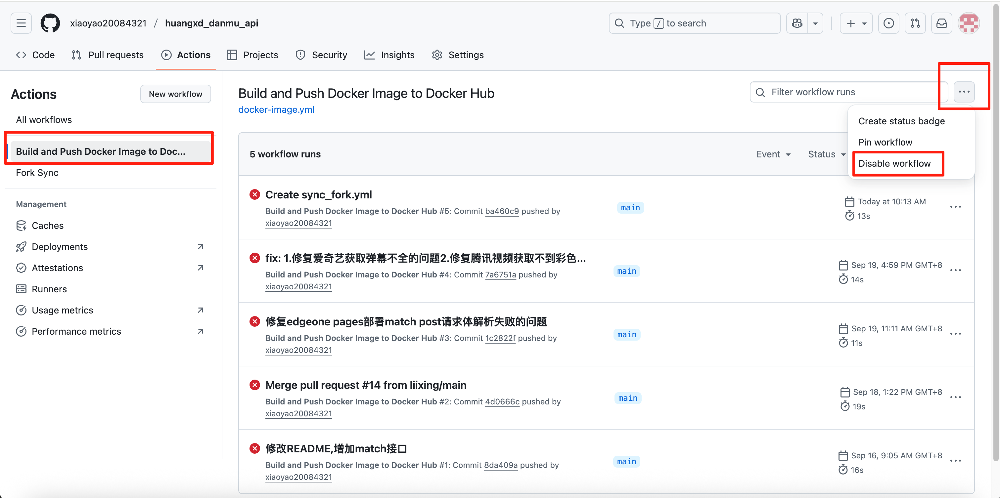

---

### 常见问题（FAQ）
- 同步失败（Actions 红叉）：查看 Actions 日志，可能是上游变更、合并冲突或网络问题；必要时手动合并一次。
---

### 参考
- 上游仓库：[`huangxd-/danmu_api`](https://github.com/huangxd-/danmu_api)
- Vercel 登录：[`https://vercel.com/login`](https://vercel.com/login)


